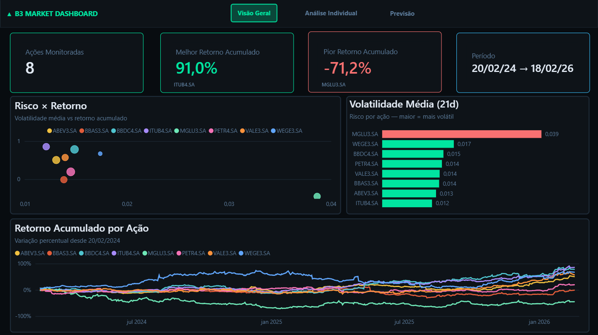
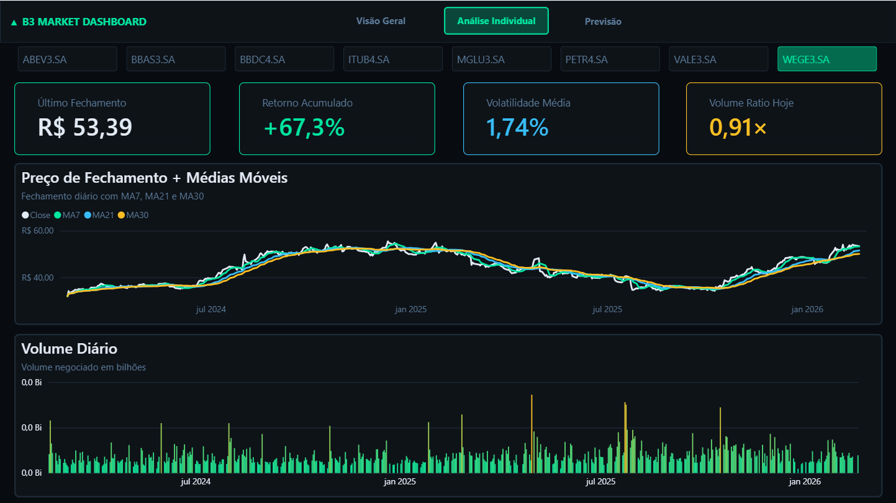
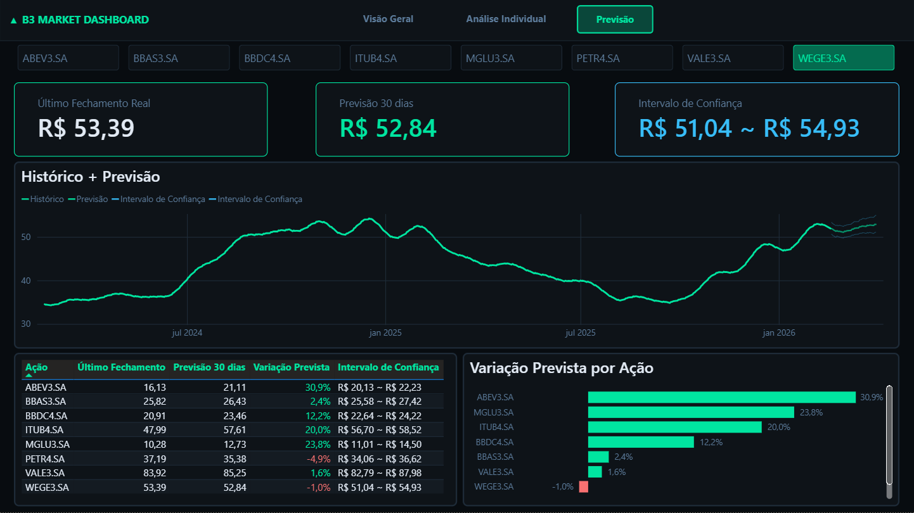

# 📈 B3 Market Dashboard

Pipeline completo de análise de ações da bolsa brasileira (B3), com coleta automatizada de dados, armazenamento em banco de dados relacional, modelo de previsão com Prophet e dashboard interativo no Power BI.

---

## 📊 Dashboard

### Visão Geral


### Análise Individual


### Previsão


---

## 🏗️ Arquitetura do Projeto

```
b3-market-dashboard/
│
├── dashboard/          # Prints e arquivo .pbix do Power BI
├── data/               # Dados brutos e processados (gerados localmente)
│   ├── raw/
│   └── processed/
├── notebooks/          # Exploração e prototipagem
├── src/
│   ├── collect.py      # Coleta de dados via yfinance
│   ├── transform.py    # Limpeza e feature engineering
│   ├── load.py         # Carga no PostgreSQL
│   └── predict.py      # Modelo de previsão Prophet
├── requirements.txt    # Dependências do projeto
└── README.md
```

### Fluxo de dados

```
yfinance API → collect.py → data/raw/
                                 ↓
                          transform.py → data/processed/
                                               ↓
                                           load.py → PostgreSQL
                                                          ↓
                                                     predict.py → stocks_forecast
                                                                        ↓
                                                                    Power BI
```

---

## 🛠️ Tecnologias

| Categoria | Tecnologia |
|---|---|
| Linguagem | Python 3.13 |
| Coleta de dados | yfinance |
| Processamento | pandas, numpy |
| Banco de dados | PostgreSQL |
| ORM / Conexão | SQLAlchemy, psycopg2 |
| Modelo de ML | Prophet (Meta) |
| Visualização | Power BI |
| Variáveis de ambiente | python-dotenv |

---

## 📦 Ações Monitoradas

| Ticker | Empresa |
|---|---|
| PETR4.SA | Petrobras |
| VALE3.SA | Vale |
| ITUB4.SA | Itaú Unibanco |
| BBDC4.SA | Bradesco |
| WEGE3.SA | WEG |
| MGLU3.SA | Magazine Luiza |
| ABEV3.SA | Ambev |
| BBAS3.SA | Banco do Brasil |

---

## ⚙️ Features Calculadas

As seguintes features são calculadas pelo `transform.py` a partir dos dados brutos:

| Feature | Descrição |
|---|---|
| `ma_7` / `ma_21` / `ma_30` | Médias móveis de 7, 21 e 30 dias |
| `daily_return` | Retorno percentual diário |
| `cumulative_return` | Retorno acumulado desde o início do período |
| `volatility_21d` | Volatilidade (desvio padrão dos retornos em 21 dias) |
| `volume_ratio` | Volume do dia / média móvel de volume (21d) |
| `price_range_pct` | Amplitude diária entre máxima e mínima (%) |

---

## 🤖 Modelo de Previsão

O modelo utiliza o **Prophet** (Meta) para previsão de séries temporais. Para cada ação são geradas previsões para os próximos **30 dias úteis**, incluindo:

- `predicted_close` — preço de fechamento previsto
- `lower_bound` — limite inferior do intervalo de confiança
- `upper_bound` — limite superior do intervalo de confiança

**Configurações do modelo:**
- `changepoint_prior_scale = 0.05` — tendência suavizada
- `seasonality_mode = multiplicative` — adequado para dados financeiros
- Sazonalidade anual e semanal habilitadas

> ⚠️ Previsões de séries temporais têm limitações inerentes. Este projeto tem fins educacionais e não constitui recomendação de investimento.

---

## 🗄️ Tabelas no PostgreSQL

| Tabela | Descrição |
|---|---|
| `stocks_raw` | Dados brutos coletados via yfinance |
| `stocks_features` | Dados com features calculadas |
| `stocks_forecast` | Previsões geradas pelo Prophet |

---

## 🚀 Como Executar

### 1. Clone o repositório
```bash
git clone https://github.com/seu-usuario/b3-market-dashboard.git
cd b3-market-dashboard
```

### 2. Crie e ative o ambiente virtual
```bash
python -m venv .venv
.venv\Scripts\activate  # Windows
```

### 3. Instale as dependências
```bash
pip install -r requirements.txt
```

### 4. Configure as variáveis de ambiente
Copie o arquivo de exemplo e preencha com suas credenciais:
```bash
cp .env.example .env
```

Conteúdo do `.env`:
```
DB_HOST=localhost
DB_PORT=5432
DB_NAME=b3_market
DB_USER=seu_usuario
DB_PASSWORD=sua_senha
```

### 5. Crie o banco de dados no PostgreSQL
```sql
CREATE DATABASE b3_market;
CREATE USER b3_user WITH PASSWORD 'sua_senha';
GRANT ALL PRIVILEGES ON DATABASE b3_market TO b3_user;
GRANT ALL ON SCHEMA public TO b3_user;
```

### 6. Execute o pipeline
```bash
# Coleta de dados
python src/collect.py

# Transformação e feature engineering
python src/transform.py

# Carga no banco de dados
python src/load.py

# Geração das previsões
python src/predict.py
```

---

## 📋 Requisitos

```
yfinance
pandas
numpy
sqlalchemy
psycopg2-binary
python-dotenv
prophet
matplotlib
```

---

## 👨‍💻 Autor

**Bruno Garcia Baricelo** — Estudante de Engenharia da Computação

[](www.linkedin.com/in/brunobaricelo)
[](https://github.com/Gnordh1)
